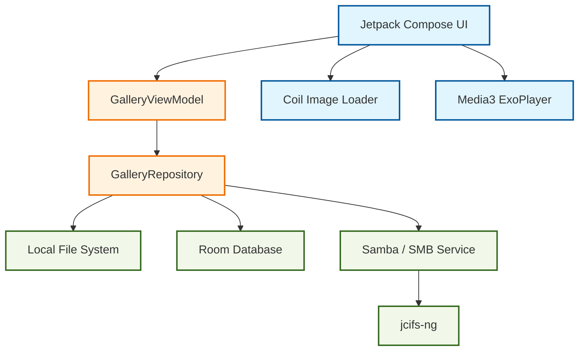

# 🦉 GuGu Gallery (gugu) - 专为 Android TV 打造的极简相册

[](https://developer.android.com/tv)
[](https://kotlinlang.org/)
[](https://developer.android.com/jetpack/compose)

**GuGu Gallery** 是一款专为 Android TV 设计的相册应用。它不仅提供极致的本地图片浏览体验，更深度集成 **Samba (SMB) 协议**，让您可以直接在电视上流畅访问 NAS 或电脑上的海量照片和视频。

---

## ✨ 核心特性

- 📺 **原生 TV 交互体验**：完美适配遥控器，焦点管理丝滑顺畅。
- 🌏 **Samba/SMB 深度集成**：支持多服务器配置，轻松访问局域网共享资源。
- ⚡ **高性能加载**：基于 Coil 的异步加载与多级缓存，大图/网络图秒开。
- 🎬 **全能播放**：集成 Media3 (ExoPlayer)，照片视频无缝切换。
- 🔍 **元数据展示**：支持 EXIF 信息查看，快门、感光度一目了然。
- 🎨 **现代 UI 设计**：采用 Material 3 设计规范，支持动态流色与毛玻璃效果。

---

## 🏗️ 技术架构

本项目遵循现代 Android 开发的最佳实践，采用 **MVVM / MVI** 架构模式。



### 核心技术栈

| 模块 | 技术方案 |
| :--- | :--- |
| **UI 框架** | Jetpack Compose (Kotlin 2.0+) |
| **TV 组件** | Compose for TV (Foundation & Material) |
| **图片加载** | Coil (AsyncImage, Subcompose) |
| **视频引擎** | Jetpack Media3 (ExoPlayer) |
| **数据存储** | Room Persistence Library |
| **网络协议** | jcifs-ng (Samba/SMB 2.x/3.x) |
| **依赖注入** | 手动依赖注入 (简单高效) |

---

## 📂 项目结构

```text
GuGuGallery/
├── app/
│   ├── src/main/java/com/gugu/gallery/
│   │   ├── data/              # 数据实体 (Room Entity, DAO, Database)
│   │   ├── network/           # 网络通信 (Samba 扫描器与获取器)
│   │   ├── ui/                # 界面展现
│   │   │   ├── screens/       # 业务屏幕 (Main, Single, Folders, Settings)
│   │   │   ├── viewmodel/     # 业务逻辑 (StateFlow 驱动)
│   │   │   ├── theme/         # 主题与样式 (Material 3)
│   │   │   └── AppNavigation.kt # 导航配置
│   │   ├── GuGuApplication.kt  # 全局初始化
│   │   └── MainActivity.kt    # 单 Activity 容器
│   └── build.gradle.kts       # 模块构建配置
├── build.gradle.kts           # 项目根构建配置
└── README.md                  # 本文档
```

---

## 🚀 快速开始

### 开发环境
- Android Studio Ladybug (或更高版本)
- Gradle 8.1+
- Android SDK 35
- JDK 17+

### 编译运行
1.  **克隆项目**:
    ```bash
    git clone https://github.com/your-username/GuGuGallery.git
    ```
2.  **配置环境**: 在 Android Studio 中打开项目，等待 Gradle 同步完成。
3.  **连接 TV/模拟器**: 确保设备已开启 ADB 调试。
4.  **运行**: 点击 `Run` 按钮或执行:
    ```bash
    ./gradlew installDebug
    ```

---

## 🛠️ 常见问题排查 (Troubleshooting)

### 1. 编译冲突：DexArchiveMergerException
**原因**: Gradle 缓存或增量构建残留。
**解决**: 执行 `./gradlew clean` 后重新构建。

### 2. TV 安装提示“未安装应用”
**原因**: Release 版本未配置签名。
**解决**:
- 开发测试请使用 `debug` 版本 (`./gradlew assembleDebug`)。
- 发布版本请在 `app/build.gradle.kts` 的 `signingConfigs` 中配置您的 `.jks` 密钥。

### 3. Samba 无法连接
**原因**: 局域网防火墙、SMB 版本不匹配或权限不足。
**解决**:
- 确保服务端开启 SMBv2/v3。
- 检查 `SettingsScreen` 中的服务器配置（IP、账号、密码及共享文件夹名）。

---

## 📄 开源协议

本项目采用 [MIT License](LICENSE) 开源。

---

🎬 *Enjoy your photos on the big screen!*
